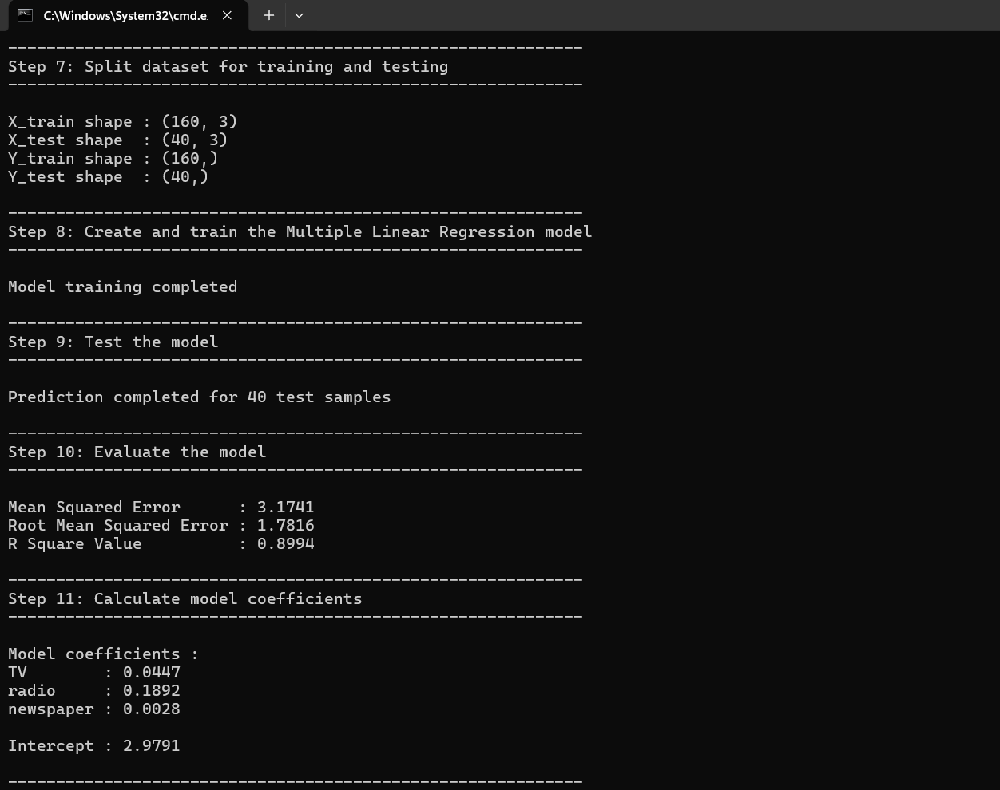
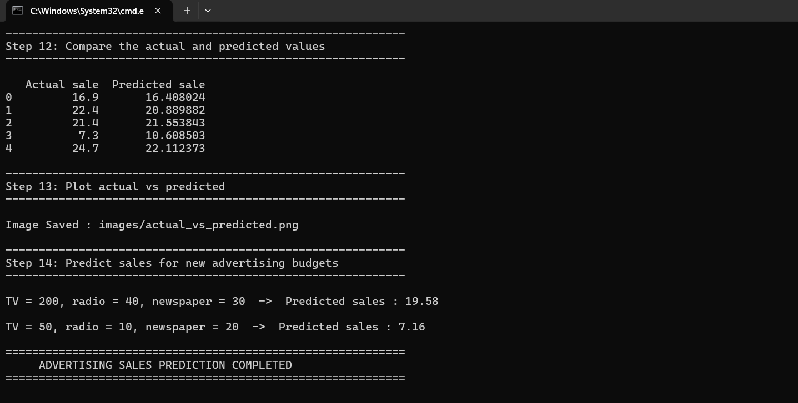

# 📈 Advertising Sales Prediction using Multiple Linear Regression

A machine learning regression project that predicts product **sales** from the advertising budget spent on **TV**, **radio** and **newspaper**, using Multiple Linear Regression.

## 🎯 Problem Statement
Given the advertising budget on TV, radio and newspaper, predict the sales of a product, and find out which advertising channel affects sales the most.

## 🛠️ Tech Stack
- Python 3
- pandas
- numpy
- scikit-learn
- matplotlib
- seaborn

## 📊 Dataset
- File: `data/advertising.csv`
- Size: 200 samples, 3 features, 1 target
- Missing values: none
- The first column in the original file is an unnamed index. The code removes it.

| Column    | Description                           | Type   |
|-----------|---------------------------------------|--------|
| TV        | Advertising budget spent on TV        | Number |
| radio     | Advertising budget spent on radio     | Number |
| newspaper | Advertising budget spent on newspaper | Number |
| sales     | Sales of the product (target)         | Number |

## 🌳 Algorithm
- **Multiple Linear Regression** (`sklearn.linear_model.LinearRegression`)
- It uses more than one feature (TV, radio and newspaper) to find the best straight-line relationship with sales.

## 🔍 Workflow
1. Load the dataset
2. Remove the unwanted index column
3. Check missing values
4. Show the statistical summary
5. Find the correlation between columns and save a heatmap
6. Split into independent (TV, radio, newspaper) and dependent (sales) variables
7. Split into training (80%) and testing (20%) sets
8. Create and train the model
9. Predict on the test data
10. Evaluate with MSE, RMSE and R²
11. Show the model coefficients and intercept
12. Compare actual and predicted sales
13. Save the actual vs predicted plot
14. Predict sales for new advertising budgets

## 📂 Project Structure
```
03-Advertising-Sales-Linear-Regression/
├── data/
│   ├── advertising.csv
│   └── README.md
├── images/
│   ├── actual_vs_predicted.png
│   ├── correlation_heatmap.png
│   ├── output_1.png
│   ├── output_2.png
│   └── README.md
├── src/
│   ├── main.py
│   └── README.md
├── requirements.txt
└── README.md
```

## ▶️ How to Run
Run from this folder (the one with `requirements.txt`):

```bash
pip install -r requirements.txt
python src/main.py
```

The charts are saved automatically in the `images` folder.

## 🖥️ Sample Output
```
Step 10: Evaluate the model
Mean Squared Error      : 3.1741
Root Mean Squared Error : 1.7816
R Square Value          : 0.8994

Step 11: Calculate model coefficients
TV        : 0.0447
radio     : 0.1892
newspaper : 0.0028

Intercept : 2.9791

Step 14: Predict sales for new advertising budgets
TV = 200, radio = 40, newspaper = 30  ->  Predicted sales : 19.58
TV = 50, radio = 10, newspaper = 20  ->  Predicted sales : 7.16
```

## 📸 Output Screenshots




## ✅ Results

| Metric                  | Value  |
|-------------------------|--------|
| Mean Squared Error      | 3.1741 |
| Root Mean Squared Error | 1.7816 |
| R² Score                | 0.8994 |

- The model explains about **90%** of the variation in sales on the test data.
- On average, the predictions are about **1.78** sales units away from the actual values (RMSE).

### Correlation with sales

| Feature   | Correlation |
|-----------|-------------|
| TV        | 0.78        |
| radio     | 0.58        |
| newspaper | 0.23        |

### Model coefficients

| Feature   | Coefficient |
|-----------|-------------|
| TV        | 0.0447      |
| radio     | 0.1892      |
| newspaper | 0.0028      |

- TV has the strongest correlation with sales.
- In the model, one extra unit of radio budget adds more sales than one extra unit of TV budget.
- Newspaper has a very small coefficient, so it adds almost nothing once TV and radio are in the model.
- The features are not scaled, so the coefficients show the effect per unit of each budget and should not be read as a ranking of importance.

### New predictions

| TV  | radio | newspaper | Predicted sales |
|-----|-------|-----------|-----------------|
| 200 | 40    | 30        | 19.58           |
| 50  | 10    | 20        | 7.16            |

The example budgets are inside the range of the data, where a linear model is reliable.

**Note:** The result comes from one train/test split of 200 samples (40 test samples), so the scores can change with a different split. This project is for learning the ML workflow.

## 📚 Learning Outcomes
- Regression problem and the Multiple Linear Regression algorithm
- Data cleaning and exploration with pandas
- Correlation analysis and heatmaps
- Evaluating a regression model with MSE, RMSE and R²
- Reading model coefficients and the intercept
- Plotting actual vs predicted values
- Predicting sales for new inputs

## 🚀 Future Improvements
- Use cross-validation for a more reliable score
- Scale the features and compare the coefficients
- Try Ridge, Lasso and Random Forest regression
- Check the model for non-linear patterns

## 👩‍💻 Author
**Ishwari Vijaykumar Surve**


GitHub: https://github.com/ishwari-surve
