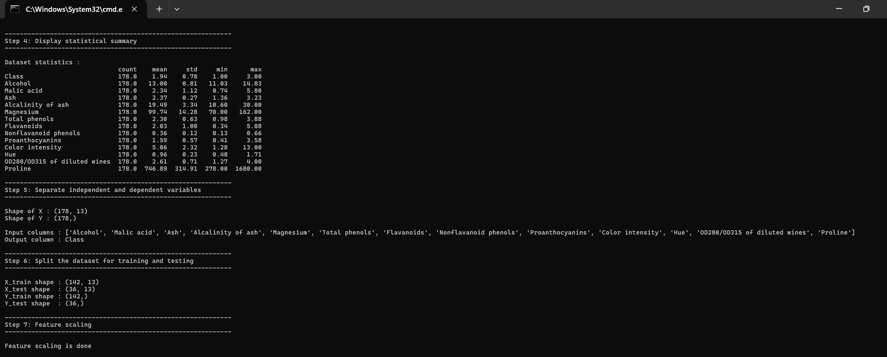
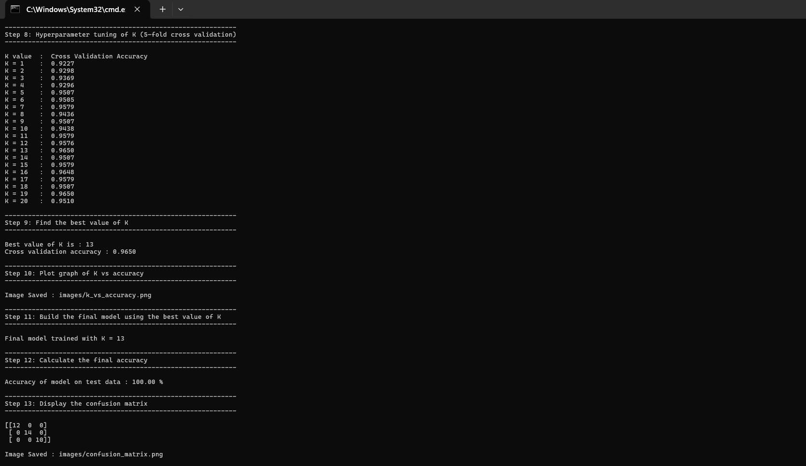
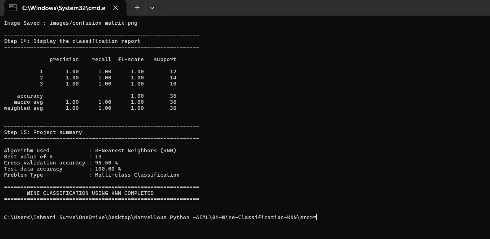

# 🍷 Wine Classification using K-Nearest Neighbors with Feature Scaling and Hyperparameter Tuning

A machine learning classification project that predicts the grape **cultivar** (variety) of a wine from its chemical analysis, using **K-Nearest Neighbors (KNN)**. The project uses **feature scaling** and finds the best value of K with **5-fold cross validation**.

## 🎯 Problem Statement
Given 13 chemical measurements of a wine (such as alcohol, flavanoids, color intensity and proline), predict which of the 3 grape cultivars the wine was made from.

## 🛠️ Tech Stack
- Python 3
- pandas
- scikit-learn
- matplotlib
- seaborn

## 📊 Dataset
- File: `data/wine.csv`
- Size: 178 samples, 13 features, 1 target (`Class`)
- Classes: Class 1 (59 samples), Class 2 (71 samples), Class 3 (48 samples)
- Missing values: none

The 13 features are chemical measurements: Alcohol, Malic acid, Ash, Alcalinity of ash, Magnesium, Total phenols, Flavanoids, Nonflavanoid phenols, Proanthocyanins, Color intensity, Hue, OD280/OD315 of diluted wines and Proline.

## 🌳 Algorithm and Techniques
- **K-Nearest Neighbors** (`sklearn.neighbors.KNeighborsClassifier`): predicts the class of a wine from its K closest wines in the training data.
- **Feature scaling** (`StandardScaler`): the features have very different ranges (Proline is in the hundreds, Hue is near 1). KNN uses distance, so the features are scaled first. The scaler learns only from the training data.
- **Hyperparameter tuning:** K from 1 to 20 is tested with 5-fold cross validation on the training data. The test data is not used to choose K.

## 🔍 Workflow
1. Load the dataset
2. Clean the dataset by removing empty rows
3. Check missing values
4. Display the statistical summary
5. Separate independent and dependent variables
6. Split into training (80%) and testing (20%) sets (stratified)
7. Scale the features
8. Tune K from 1 to 20 with 5-fold cross validation
9. Find the best value of K
10. Plot K vs accuracy
11. Build the final model with the best K
12. Calculate the final accuracy on the test data
13. Display the confusion matrix
14. Display the classification report
15. Display the project summary

## 📂 Project Structure
```
04-Wine-Classification-KNN/
├── data/
│   ├── wine.csv
│   └── README.md
├── images/
│   ├── k_vs_accuracy.png
│   ├── confusion_matrix.png
│   ├── output_1.png
│   ├── output_2.png
│   ├── output_3.png
│   └── README.md
├── src/
│   ├── main.py
│   └── README.md
├── requirements.txt
└── README.md
```

## ▶️ How to Run
Run from this folder (the one with `requirements.txt`):

```bash
pip install -r requirements.txt
python src/main.py
```

The charts are saved automatically in the `images` folder.

## 🖥️ Sample Output
```
Step 9: Find the best value of K
Best value of K is : 13
Cross validation accuracy : 0.9650

Step 12: Calculate the final accuracy
Accuracy of model on test data : 100.00 %

Step 13: Display the confusion matrix
[[12  0  0]
 [ 0 14  0]
 [ 0  0 10]]

Step 15: Project summary
Algorithm Used            : K-Nearest Neighbors (KNN)
Best value of K           : 13
Cross validation accuracy : 96.50 %
Test data accuracy        : 100.00 %
Problem Type              : Multi-class Classification
```

## 📸 Output Screenshots




## ✅ Results

| Measure                                | Value    |
|----------------------------------------|----------|
| Best value of K                        | 13       |
| Cross validation accuracy (training)   | 96.50 %  |
| Accuracy on test data (36 samples)     | 100.00 % |

- All 36 test wines were classified correctly: 12 of Class 1, 14 of Class 2 and 10 of Class 3.
- Precision, recall and F1-score are 1.00 for every class.
- The cross validation accuracy (96.50 %) is the more reliable estimate, because the test set has only 36 samples. A different split can give a slightly different test accuracy.

### K vs Accuracy


### Confusion Matrix


## 📚 Learning Outcomes
- Exploratory data analysis: missing values and statistical summary
- Multi-class classification with K-Nearest Neighbors
- Why distance-based models need feature scaling
- Avoiding data leakage: the scaler learns only from the training data, and K is chosen without the test data
- Hyperparameter tuning with 5-fold stratified cross validation
- Evaluating a classifier with accuracy, confusion matrix and classification report

## 🚀 Future Improvements
- Try other models (Logistic Regression, Random Forest, SVM) and compare
- Use `GridSearchCV` to tune K, the distance metric and the weights
- Test the model on a larger wine dataset
- Check which features matter most

## 👩‍💻 Author
**Ishwari Vijaykumar Surve**


GitHub: https://github.com/ishwari-surve
