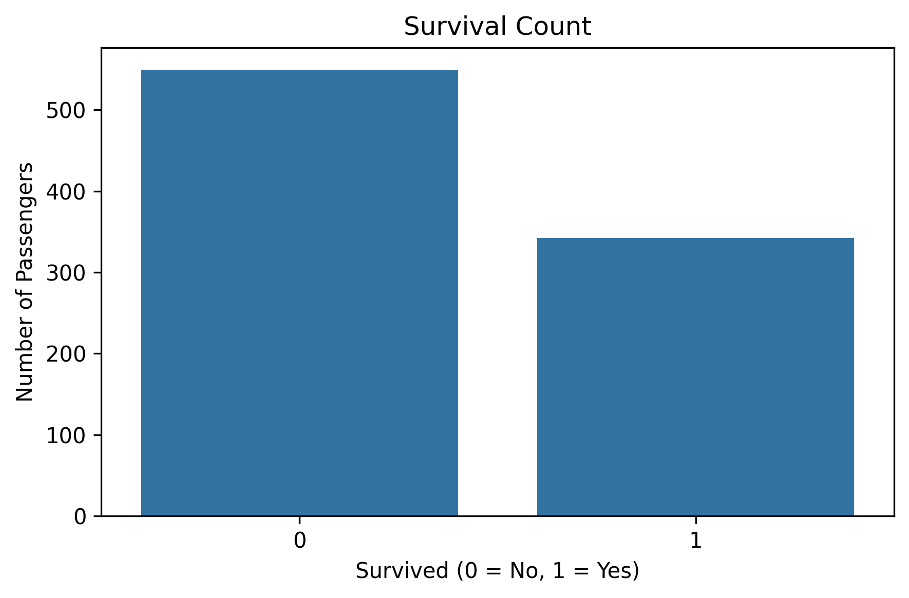
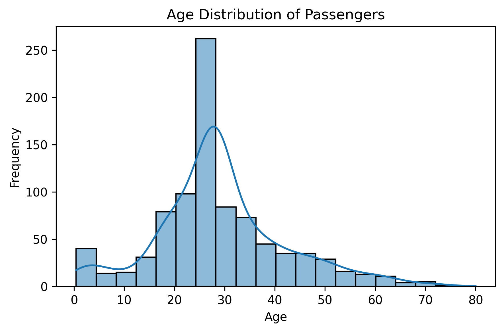
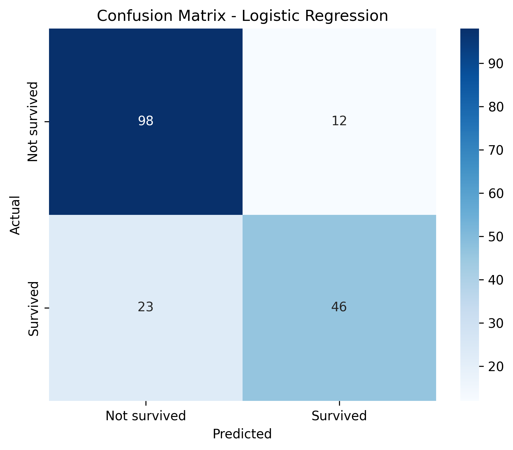

# 🚢 Titanic Survival Prediction using Logistic Regression

A machine learning classification project that predicts whether a passenger survived the Titanic disaster using **Logistic Regression**. The project includes data preprocessing, missing value handling, categorical feature encoding, model training, evaluation, and visualization.

## 🎯 Problem Statement

Given passenger information such as age, fare, sex, passenger class, number of siblings or spouses, number of parents or children, and embarkation point, predict whether the passenger survived the Titanic disaster.

- `0` – Did not survive
- `1` – Survived

## 🛠️ Tech Stack

- Python 3
- pandas
- scikit-learn
- matplotlib
- seaborn
- joblib

## 📊 Dataset

- **File:** `data/titanic.csv`
- **Original dataset size:** 1,309 rows and 10 columns
- **Records used for training and evaluation:** 891 passengers
- **Input features after preprocessing:** 8
- **Target variable:** `Survived`
- **Missing values:** 2 missing values in `Embarked`, handled using the mode; missing numerical values are handled using the median.
- **Problem type:** Binary Classification

The dataset contains passenger-related information, including age, fare, sex, passenger class, family-related counts, and embarkation point.

The program excludes the 418 records after Passengerid 891 because their survival labels are treated as placeholders. This assumption should be verified against the source dataset.

## 🤖 Algorithm and Techniques

- **Logistic Regression** (`sklearn.linear_model.LogisticRegression`): predicts whether a passenger survived or did not survive.
- **Missing value handling:** fills missing numerical values using the median and missing `Embarked` values using the mode.
- **Categorical feature encoding:** applies one-hot encoding to `Embarked`.
- **Feature selection:** removes `Passengerid` and `zero` from the model inputs.
- **Train-test split:** divides the labelled dataset into training (80%) and testing (20%) sets using stratification.
- **Model persistence:** saves and reloads the trained model using Joblib.
- **Model evaluation:** calculates accuracy, confusion matrix, classification report, and majority-class baseline.
- **Data visualization:** generates plots for survival counts, age distribution, and the confusion matrix.

## 🔍 Workflow

1. Load the Titanic dataset.
2. Remove passenger records assumed to contain placeholder survival labels.
3. Remove unnecessary columns.
4. Handle missing values.
5. Encode the categorical `Embarked` feature.
6. Separate independent and dependent variables.
7. Split the dataset into training (80%) and testing (20%) sets.
8. Train the Logistic Regression model.
9. Display model coefficients and intercept.
10. Save the trained model using Joblib.
11. Load the saved model.
12. Evaluate the model using accuracy, baseline accuracy, confusion matrix, and classification report.
13. Plot the survival count.
14. Plot the age distribution.
15. Plot the confusion matrix.
16. Display the project summary.

## Project Structure
```
05-Titanic-Survival-Logistic-Regression/
├── data/
│   ├── titanic.csv
│   └── README.md
├── images/
│   ├── survival_count.png
│   ├── age_distribution.png
│   ├── confusion_matrix.png
│   ├── output_1.png
│   ├── output_2.png
│   ├── output_3.png
│   └── README.md
├── models/
│   └── README.md
├── src/
│   ├── main.py
│   └── README.md
├── requirements.txt
└── README.md
```
The model file `models/titanic_model.pkl` is generated when the program runs. It can be excluded from GitHub using `.gitignore`.
```

## ▶️ How to Run

Run the following commands from the project root directory, where `requirements.txt` is located:

```bash
pip install -r requirements.txt
python src/main.py
```

Ensure that the dataset is available at:

```text
data/titanic.csv
```

The charts are generated automatically and saved in the `images` folder.

## 🖥️ Sample Output

```text
Step 8: Train the Logistic Regression model
Model trained successfully

Step 12: Evaluate the model

Accuracy of model on test data      : 80.45 %
Baseline accuracy (always 'No')     : 61.45 %

Confusion matrix :
[[98 12]
 [23 46]]

Step 14: Project summary

Algorithm Used     : Logistic Regression
Test accuracy      : 80.45 %
Baseline accuracy  : 61.45 %
Problem Type       : Binary Classification
```

## 📸 Output Screenshots

Add terminal screenshots to the `images` folder if you want to document the execution output.

### Survival Count



### Age Distribution



### Confusion Matrix



## ✅ Results

| Measure | Value |
|---|---:|
| Algorithm | Logistic Regression |
| Training samples | 712 |
| Testing samples | 179 |
| Input features | 8 |
| Test accuracy | 80.45% |
| Majority-class baseline accuracy | 61.45% |
| Problem type | Binary Classification |

### Confusion Matrix

```text
[[98 12]
 [23 46]]
```

The confusion matrix indicates:

- **98** passengers who did not survive were correctly classified.
- **12** passengers who did not survive were incorrectly classified as survivors.
- **23** passengers who survived were incorrectly classified as non-survivors.
- **46** passengers who survived were correctly classified.

### Classification Report

| Class | Precision | Recall | F1-score | Support |
|---|---:|---:|---:|---:|
| Not survived | 0.81 | 0.89 | 0.85 | 110 |
| Survived | 0.79 | 0.67 | 0.72 | 69 |
| Macro average | 0.80 | 0.78 | 0.79 | 179 |
| Weighted average | 0.80 | 0.80 | 0.80 | 179 |

The model achieved **80.45% test accuracy**, compared with the **61.45% majority-class baseline**. It performed better at identifying passengers who did not survive than passengers who survived, as reflected in the recall values of 0.89 and 0.67, respectively.

These results apply to the current train-test split and preprocessing approach; they do not guarantee the same performance on other datasets.

## 📚 Learning Outcomes

- Loading and inspecting a dataset using pandas
- Handling missing numerical and categorical values
- Removing unnecessary features
- Applying one-hot encoding
- Splitting data into training and testing sets using stratification
- Implementing binary classification using Logistic Regression
- Understanding model coefficients and the intercept
- Saving and reloading a model using Joblib
- Evaluating a classifier using accuracy, confusion matrix, precision, recall, and F1-score
- Visualizing survival counts and age distribution
- Comparing model accuracy with a majority-class baseline

## 🚀 Future Improvements

- Compare Logistic Regression with Decision Tree, Random Forest, and K-Nearest Neighbors.
- Tune model hyperparameters using cross-validation.
- Improve feature engineering using passenger titles and family size.
- Investigate the effects of different feature selection and preprocessing strategies.
- Evaluate the model using ROC-AUC and cross-validation.
- Verify the survival labels and dataset assumptions before training.

## 👩‍💻 Author

**Ishwari Vijaykumar Surve**

GitHub: https://github.com/ishwari-surve
 

